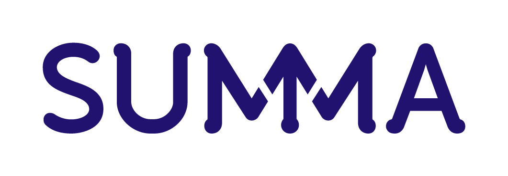

# Huisstijl Summa Skill

Complete Summa huisstijl implementatie met CSS framework, component bibliotheek en demo's volgens het officiële Huisstijlhandboek (versie februari 2026).

## 📦 Installatie

### Via GitHub
```bash
cd ~/.claude/skills
git clone https://github.com/MrGusFring/huisstijl-summa-skill.git huisstijl-summa
```

### Via download
1. Download en pak het archief uit
2. Plaats de `huisstijl-summa` folder in `~/.claude/skills/`
3. Herstart Claude Code

De skill is nu beschikbaar via `/huisstijl-summa`

## 🚀 Gebruik

### Als Claude Code Skill
Roep de skill aan in Claude Code voor interactieve hulp:
```
/huisstijl-summa
```

De skill helpt je met:
- Keuze maken tussen logo en vignet varianten
- Kleuren en contrast bepalen
- Typografie toepassen
- Componenten samenstellen volgens huisstijl
- Toegankelijkheid waarborgen

### Als CSS Framework
Gebruik het CSS framework direct in je projecten:

```html
<!DOCTYPE html>
<html lang="nl">
<head>
    <link rel="stylesheet" href="path/to/summa-styles.css">
</head>
<body>
    <div class="container">
        <h1>Jouw Summa Website</h1>
        <button class="btn btn-primary">Start nu</button>
    </div>
</body>
</html>
```

## 📁 Bestandsstructuur

```
~/.claude/skills/huisstijl-summa/
├── skill.md                    # Skill definitie met volledige huisstijl richtlijnen
├── README.md                   # Deze documentatie
├── QUICK_REFERENCE.md          # Snelle referentie voor ontwikkelaars
│
├── summa-styles.css            # ⭐ Volledig CSS framework
├── demo.html                   # ⭐ Interactieve demo van alle elementen
├── components.html             # ⭐ Component bibliotheek met code voorbeelden
│
└── assets/                     # Officiële Summa assets
    ├── SUMMA_Logo_RGB_Indigo.png       # Logo voor lichte achtergronden
    ├── SUMMA_Logo_RGB_Wit.png          # Logo voor donkere achtergronden
    ├── SUMMA_Vignet_indigo_RGB.png     # Vignet (compact) voor lichte achtergronden
    └── SUMMA_Vignet_wit_RGB.png        # Vignet (compact) voor donkere achtergronden
```

## 🎨 Wat zit erin?

### 1. CSS Framework (`summa-styles.css`)

Compleet CSS framework met:
- **CSS Custom Properties** voor alle kleuren, fonts, spacing, en radius
- **Typography systeem** (Myriad Pro + Bitter met fallbacks)
- **Component classes** (buttons, cards, forms, navigation)
- **Layout utilities** (grid, flexbox, container)
- **Accessibility** (focus states, skip links, reduced motion)
- **Responsive design** (mobile-first met breakpoints)

### 2. Demo Pagina (`demo.html`)

Uitgebreide demo met:
- ✅ Kleurenpalet met hex/RGB waarden
- ✅ Typografie voorbeelden (alle koppen, body, quotes)
- ✅ Buttons in verschillende varianten en maten
- ✅ Cards (standaard en indigo varianten)
- ✅ Formulieren met inputs, textareas, selects
- ✅ Logo en Vignet gebruik (alle varianten)
- ✅ Afgeronde hoeken demonstratie
- ✅ Pay off component
- ✅ Grid systeem
- ✅ Navigation en Footer

**Gebruik:** Open `demo.html` in je browser om alle mogelijkheden te zien!

### 3. Component Bibliotheek (`components.html`)

Herbruikbare componenten met code voorbeelden:
- 🧩 Navigation Bar
- 🧩 Hero Section
- 🧩 Feature Cards
- 🧩 Call-to-Action Banner
- 🧩 Testimonial / Quote
- 🧩 Contact Form
- 🧩 Statistics Section
- 🧩 Footer
- 🧩 Notice / Alert Banner

Elk component toont de preview + HTML code om te kopiëren!

### 4. Quick Reference (`QUICK_REFERENCE.md`)

Snelle naslaggids met:
- Kleurcodes en CSS variabelen
- Font stacks en sizes
- Component cheat sheet
- Logo gebruik regels
- Border radius formule
- Spacing schaal
- Microregels (telefoonnummers)
- Toegankelijkheid checklist

## 🎯 Snelstart Voorbeelden

### Simpele pagina met huisstijl

```html
<!DOCTYPE html>
<html lang="nl">
<head>
    <meta charset="UTF-8">
    <meta name="viewport" content="width=device-width, initial-scale=1.0">
    <title>Summa Pagina</title>
    <link rel="stylesheet" href="summa-styles.css">
</head>
<body>
    <!-- Navigation -->
    <nav class="navbar">
        <div class="container">
            <div class="flex items-center justify-between">
                
                <ul class="nav-list">
                    <li><a href="#" class="nav-link">Home</a></li>
                    <li><a href="#" class="nav-link">Over ons</a></li>
                </ul>
            </div>
        </div>
    </nav>

    <!-- Hero -->
    <div class="container section">
        <div style="background: var(--summa-indigo); color: white;
                    padding: var(--space-16); border-radius: var(--radius-xl);
                    text-align: center;">
            <h1 style="color: white;">Welkom bij Summa</h1>
            <p style="font-size: var(--text-xl);">Samen kun je meer.</p>
            <button class="btn btn-secondary">Meer informatie</button>
        </div>
    </div>

    <!-- Content -->
    <section class="section">
        <div class="container">
            <div class="grid grid-cols-3">
                <div class="card">
                    <h3 class="card-title">Praktijkgericht</h3>
                    <p>Leer door te doen.</p>
                </div>
                <div class="card">
                    <h3 class="card-title">Persoonlijk</h3>
                    <p>Begeleiding op maat.</p>
                </div>
                <div class="card">
                    <h3 class="card-title">Toekomstgericht</h3>
                    <p>Voor jouw carrière.</p>
                </div>
            </div>
        </div>
    </section>
</body>
</html>
```

### Alleen de essentials gebruiken

Je hoeft niet het volledige framework te laden. Kopieer alleen de CSS variabelen en bouw je eigen classes:

```css
:root {
  --summa-indigo: #20126E;
  --summa-white: #FFFFFF;
  --summa-lightgrey: #F4F4F4;
  --font-primary: 'Myriad Pro', 'Open Sans', sans-serif;
  --font-secondary: 'Bitter', Georgia, serif;
}

body {
  font-family: var(--font-primary);
  color: var(--summa-indigo);
}

h1, h2, h3 {
  font-family: var(--font-secondary);
}
```

## 🎨 Belangrijkste Huisstijl Regels

### Kleuren
- **Primair:** Indigo `#20126E`
- **Neutraal:** Wit `#FFFFFF`, Lichtgrijs `#F4F4F4`
- **Online contrast:** Minimaal 4.5:1 voor tekst (WCAG AA)

### Typografie
- **Body:** Myriad Pro (fallback: Open Sans)
- **Koppen:** Bitter Bold (fallback: Georgia)
- **Instellingen:** Letter-spacing metrisch, geen ligaturen

### Logo
- **Lichte achtergrond:** Indigo variant
- **Donkere achtergrond:** Witte variant
- **Geen effecten:** Geen schaduwen, borders, of kleurvarianten

### Afgeronde Hoeken
- **Formule:** `radius = korte zijde / 50`
- **Vlak-in-vlak:** `radius × 0.8`

### Telefoonnummers
- **Format:** `040 269 4000` (met spaties, zonder streepjes)

## 📚 Resources

- **Demo bekijken:** Open `demo.html` in je browser
- **Componenten:** Bekijk `components.html` voor code voorbeelden
- **Snelle referentie:** Check `QUICK_REFERENCE.md`
- **Skill gebruiken:** Roep `/huisstijl-summa` aan in Claude Code

## ✅ Implementatie Checklist

Voordat je live gaat:

- [ ] Alleen officiële kleuren gebruikt (indigo, wit, lichtgrijs)
- [ ] Contrast gecheckt voor online gebruik (min. 4.5:1)
- [ ] Juiste fonts met fallbacks (Myriad Pro, Bitter)
- [ ] Correcte logo variant op basis van achtergrond
- [ ] Afgeronde hoeken volgens formule toegepast
- [ ] Telefoonnummers met spaties (geen streepjes)
- [ ] Alt-teksten voor afbeeldingen
- [ ] Focus states voor toetsenbordnavigatie
- [ ] Responsive design getest op mobiel
- [ ] Prefers-reduced-motion gerespecteerd

## 💡 Tips voor Ontwikkelaars

1. **Begin met de demo:** Open `demo.html` om te zien wat mogelijk is
2. **Kopieer componenten:** Gebruik `components.html` als startpunt
3. **CSS Variabelen:** Gebruik altijd `var(--summa-indigo)` etc. voor consistentie
4. **Logo keuze:** Lichte achtergrond = indigo, donkere achtergrond = wit
5. **Vignet gebruiken:** Voor compacte ruimtes waar het logo niet past
6. **Test toegankelijkheid:** Gebruik browser dev tools voor contrast checks
7. **Mobile first:** Test altijd op verschillende schermen

## 🔧 Aanpassen

Het framework is volledig customizable via CSS variabelen in `summa-styles.css`.

Wil je de skill instructies aanpassen?
1. Open `skill.md`
2. Pas de instructies aan
3. Test met `/huisstijl-summa`

## 📞 Support

- **GitHub Issues:** Report bugs of vraag features aan
- **Documentatie:** Raadpleeg het Summa Huisstijlhandboek (februari 2026)
- **Claude Code:** Gebruik `/huisstijl-summa` voor interactieve hulp

## 📄 Licentie

Deze skill en assets zijn eigendom van Summa College. Gebruik alleen voor Summa-gerelateerde projecten.
